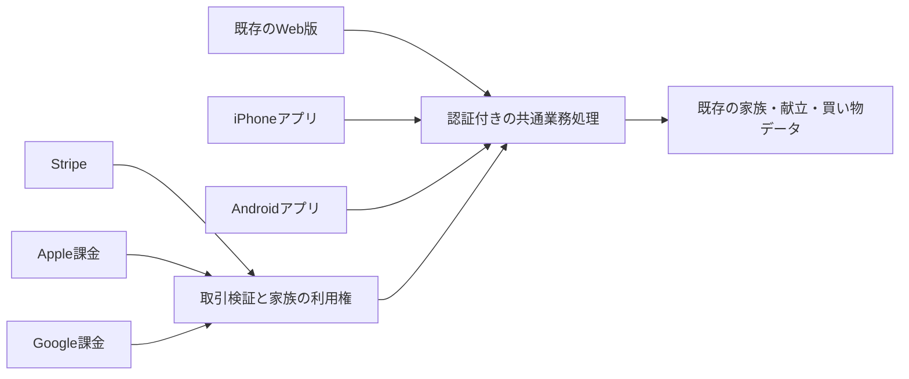

# 「きょうのごはん」スマホアプリ版 仕様書 v0.1

作成日：2026年9月22日

状態：検討・承認用。実装、開発者登録、課金商品作成、ストア申請は未実施。

対象：日本向けのApp Store／Google Play公開。Apple・Googleの開発者アカウントは両方未取得（ユーザーの回答で確認）。

## 1. 今回の提案

**今の献立と家族のデータを引き継ぎ、買い物中と調理中にすぐ使えるスマホアプリを作る。**

| 項目 | 推奨する初版 |
| --- | --- |
| 対象 | 日本語・日本向け。iPhoneとAndroidスマートフォン |
| 主な価値 | 献立から必要な買い物が分かる。家族でチェックを共有できる |
| 作り方 | 既存のReact画面・計算処理を再利用し、Capacitorで両OS向けに配布する |
| Web版 | 継続。アプリと同じアカウント・家族・保存データを利用する |
| アプリ独自の初版機能 | 保存した買い物リストの圏外閲覧、任意の買い物・仕込み通知、端末の共有メニュー |
| 課金 | 無料ダウンロード＋家族単位の定期購入。月480円／年4,800円を目標 |
| 決済 | WebはStripe、iPhoneはApple、AndroidはGoogle。利用権は家族単位で共通化 |
| 公開順 | 両OSを開発し、iPhoneで先に使用感を確認。Androidテストも進め、合格したOSから公開 |
| 工数の目安 | 26〜42人日程度の概算。登録・テスト・審査を含め、暦では7〜12週間程度を仮置き |
| 最初に着手する範囲 | 3〜5人日の技術検証。既存画面の再利用・ログイン・端末保存・課金の接続を確認 |

工数は今回のコード調査に基づく計画値で、納期や請求額ではない。実装承認後の技術検証で更新する。ストア公開による自然流入や、通知による継続率の改善は仮説として扱う。

## 2. 目的と成功の定義

対象は、日々の献立と買い物を担当する大人、分担するパートナー・家族。子ども専用アプリとしては設計しない。

解決する場面は次の3つ。

1. スーパーで「何を買うか」をすぐ確認する。
2. 台所で「今日の献立と、次にやる作業」をすぐ確認する。
3. 家族が買ったもの・終えた作業を、別の端末でも確認する。

体験の目標は「開いて5秒以内に、今日やることが分かる」。表示が速くても古いデータを最新として見せない。節約については、ムダ買いを減らすための支援として説明し、金額や成果を保証しない。

初回公開の合格は、インストール、登録、献立保存、買い物、家族共有、購入・復元、退会が実機で一通り完了すること。ビルド成功やシミュレーターだけでは合格にしない。

## 3. 現状調査と再利用範囲

### 3.1 確認した事実

- Next.js 16／React 19、Supabase、Stripeで構成されている。
- 認証はメールとパスワード。家族の所属は`profiles.household_id`で管理する。
- 献立、レシピ、朝食設定、買い物、家族招待に既存実装がある。
- ログイン後の画面は動的描画で、CookieとServer Actionsに依存する。
- 現在の購読記録は家族につき1行で、Stripeの契約情報を中心にしている。
- アイコンとWebアプリ用のmanifestがある。ネイティブ課金、端末通知、圏外閲覧の完成を示す証拠ではない。
- 無料プランの表示と有料機能キーは完全には一致していない。機能キーがあるだけで実際に制限されているとは判断できない。

調査時の作業中チェックアウトは`e427663`を基点に多数の未コミット変更がある。ローカルに保存された`origin/main`は`8524b56`で、買い物完了・取り消し、副菜、登録導線の後続変更を含む。両方を読み、作業中のファイルは変更していない。今回、リモートの再取得や本番DB・認証画面の確認はしていない。

実装開始時は承認された最新のリリース基点を確認し、独立した作業場所で進める。古いチェックアウトの機能だけをアプリ化しない。

### 3.2 再利用する部分と追加する部分

| 区分 | 対象 |
| --- | --- |
| 再利用 | 献立・人数換算・買い物集計の計算、レシピデータ、色・アイコン・表示部品、家族と権限の考え方 |
| 接続を変更 | ページ遷移、ログイン、Server Actionsを呼ぶ画面、写真選択、家族招待のリンク |
| 新規に追加 | スマホ用配布プロジェクト、API、端末保存、通知、Apple／Google課金、購入復元、退会導線 |
| 移行設計が必要 | 家族単位の利用権と複数決済元の契約記録、契約管理者、端末に保存した情報の扱い |

## 4. 初版に含める機能

| 機能 | 初版での動作 | 方針 |
| --- | --- | --- |
| 今日 | 朝・夜の献立、仕込み・調理手順、完了チェック | 現行の使い方を維持 |
| 献立 | 月間作成・保存、日別変更、固定、朝食・副菜の設定反映 | 現行の保存データを共有 |
| 買い物 | 今日だけ／7日間／期間指定、食材集計、手動追加、チェック、完了履歴、最新完了の取り消し | 初版の中心機能 |
| メニュー | 一覧・詳細・家庭の登録済みレシピ・既存の登録編集 | 権限は承認されたWeb版と揃える |
| 家族共有 | 招待・参加・共有解除、前面表示中の更新反映 | 同じ家族データを使う |
| 圏外閲覧 | 最後に保存した買い物リストを読む | 編集・完了操作はオンラインのみ |
| 通知 | 買い物曜日の通知、任意の仕込み確認通知 | 端末内で予約する通知。初期値はOFF |
| 設定 | 家族人数・アレルギー・朝食、通知、契約、復元、ログアウト、退会 | 設定は目的別にまとめる |
| サポート | 問い合わせ、利用規約、プライバシー、契約・解約の説明 | アプリ内から到達可能 |

既存レシピの公開範囲は引き継ぎ、初版では新しい公開投稿・交流機能を増やさない。公開コンテンツが申請版に含まれる場合は、掲載権利と通報・運営対応を別途点検する。

### 初版に含めないもの

- 圏外でのチェック・追加・削除と、その後の自動同期。
- 家族の操作を知らせる即時プッシュ通知。
- 食材在庫の入力、レシート読取、バーコード、AI献立、ウィジェット。
- Google／Appleによる新しいソーシャルログイン、SNS投稿、広告配信、多言語展開。
- 新しいモニターキャンペーン、アプリ独自の無料体験期間、既存利用者への自動課金。

「圏外でも見られる」と「圏外でもチェックできる」は別の機能として、ストア説明にも正確に記載する。

## 5. 画面と操作

### 5.1 画面構成

現行の5タブを継承し、表示名は短くする。

| タブ | 最初に見せるもの | 主な操作 |
| --- | --- | --- |
| 今日 | 今日の献立と作業 | 作業チェック、レシピを開く |
| 献立 | 月間カレンダー | 作成・変更・固定・保存 |
| 買い物 | 対象期間、未購入品、保存・同期状態 | チェック、追加、買い物完了 |
| メニュー | レシピ一覧 | 検索、詳細、登録・編集 |
| 設定 | 家族・通知・契約 | 招待、復元、通知設定、退会 |

通常の新規起動は「今日」。バックグラウンドからの復帰は直前の画面・スクロール位置を維持する。通知や招待リンクからの起動は該当画面を優先する。起動時に販売用LPは挟まない。

### 5.2 初回利用

1. 「無料で始める」「ログイン」「招待から参加」を表示。登録前にはサンプル画面も見られる。
2. 新規利用者はメールとパスワードを登録。既存利用者は同じアカウントでログインする。
3. 新しい家族だけ、人数・買い物曜日・アレルギーを確認する。既存利用者に再入力させない。
4. 献立を保存し、買い物リストへ進める。初回起動で課金や通知許可を強制しない。
5. 家族招待など有料機能を使う時点で、料金と家族単位の契約を説明する。

### 5.3 ログインと招待

- メール確認・パスワード再設定・招待URLから、アプリの適切な画面へ戻る。期限切れ時は再送・再招待の案内を出す。
- アプリ未導入ならWebに案内する。インストール後は元の招待リンクをもう一度開く方式を初版とし、自動的な招待引き継ぎは保証しない。
- 既存の匿名家族参加は、最新の本番仕様と権限を確認して引き継ぐ。端末を替える／削除する場合は再招待が必要と明示する。
- Safari／Chromeのログイン状態とアプリの状態は別。既存Webの匿名参加者も、必要に応じてアプリ用に再招待する。
- 匿名参加者は購読を購入・管理できない。登録済みユーザーと同様、家族外のデータにアクセスできない。
- 永続ログイン用の認証情報はOSの安全な保存領域を使い、アプリ内の一般設定やログに残さない。

認証リンクとアプリへの復帰は専用の設定・実機検証が必要。[Supabaseのモバイル認証リンク仕様](https://supabase.com/docs/guides/auth/native-mobile-deep-linking)

### 5.4 買い物リストの圏外閲覧

- オンラインで取得が成功した買い物リストを、家族・ユーザー・期間・取得日時と一緒に端末へ保存する。
- 圏外でアプリを起動し直しても、そのリストを読める。未取得なら「接続してリストを保存してください」と表示する。
- 画面上部に「オフライン・○月○日○時のリスト」を常時表示する。古いリストを最新として扱わない。
- 圏外のチェック・手動追加・期間変更・完了・取り消しは無効化し、「更新には接続が必要です」と説明する。
- 保存データは最大24時間、または確認済み共有権限の期限までの短いほうを目安に表示可能とする。期限後は再接続を求める。端末時計だけで権限期限を延長できない設計にする。
- ログアウト・退会・家族変更ではキャッシュと通知を消去。オンラインで共有解除・権限失効が判明したときも消去する。
- 圏外の端末から既に取得した情報を即時回収することはできない。この制約を共有解除の説明に含める。
- 復帰時は認証・家族所属を確認してから最新リストを取得する。変更があれば「家族の更新を反映しました」と伝える。

端末保存は買い物リストに絞る。レシピ写真や全履歴を大量に保存しない。一般の共有ストレージや端末バックアップに平文で複製されないようにする。

### 5.5 通信中の操作と家族共有

- チェックは見た目に即時反映しても、保存完了までは「保存中」を区別する。失敗は元に戻し、再確認できる状態にする。
- 完了・取り消しはサーバーで確定してから成功を表示する。同じ操作の再送で履歴を二重に作らない。
- 献立や期間が他端末で変わっていた場合は、古いリストにそのまま操作を適用せず、最新状態を取得して知らせる。
- 同じ品目の競合は版を確認し、古い版の更新を拒否して再表示する。別品目への操作は独立して保存できる。
- 前面表示中は既存の家族限定配信を利用。配信切断時、前面復帰時、手動更新時にも再取得する。バックグラウンド常時同期は約束しない。
- 「買い物完了」による次回の重複除外と、最新の完了だけを取り消せる制約を維持する。

### 5.6 通知

初版はサーバーからのプッシュ配信ではなく、その端末で予約する通知にする。[Capacitor Local Notifications](https://capacitorjs.com/docs/apis/local-notifications)

- 買い物：曜日・時刻を利用者が選択。「買い物リストを確認しましょう」から買い物タブへ。
- 仕込み：希望する曜日・時刻を選択。「今日の段取りを確認しましょう」から今日タブへ。
- 通知は端末ごと。家族全員に一括で許可を求めない。利用者がONにしたときだけOSへ許可を求める。
- 献立名やアレルギーなどの個人情報を通知本文に含めない。仕込みの有無を断定する文面も使わない。
- 端末で設定した時刻を基準とし、OS設定変更・再起動・前面復帰で予約を確認する。他端末の曜日変更は次のオンライン起動時に反映する。
- 予約は直近7日分とし、利用再開時に延長する。長期未利用時の古い通知を抑える。ログアウト時は全予約を取り消す。
- 正確な分刻みの配信を必要条件にせず、特別な正確アラーム権限は初版では求めない。OSの省電力等による遅延は実機で確認する。

## 6. 料金と契約

### 6.1 商品の提案

| 商品 | 目標価格 | 利用内容 |
| --- | --- | --- |
| 無料 | 0円 | ひとりの月間献立作成・保存、今日の段取り、買い物。現行の利用可能範囲を引き継ぐ |
| 家族プラン 月払い | 月480円 | 無料機能＋家族招待・継続共有・家族のチェック同期。既存の有料機能も維持 |
| 家族プラン 年払い | 年4,800円 | 月払いと同じ機能 |

圏外閲覧と端末通知は無料にも付け、アプリとして使いやすい基本体験にする。独自の新しい利用回数制限は作らない。「わが家のメニュー」など既存の無料／有料の表示と実際の制御の差は、技術検証時に現行本番の実動作と照合し、確定した機能表を実装前に提示する。今回の仕様を理由に既存利用者のアクセスを黙って減らさない。

480円／4,800円は現在のWeb表示に合わせた提案。ストア管理画面で設定可能な価格を確認し、異なる価格しか設定できない場合は商品作成前に判断する。購入画面ではストアが返す税込価格・期間を表示する。既存契約の価格は変更しない。

### 6.2 購入の流れ

1. 登録済みの契約管理者が、プランと請求周期を選ぶ。
2. サーバーが家族の既存契約と購入処理中の状態を確認する。
3. Apple／Googleの購入画面を開く。
4. サーバーがストアの取引情報を検証し、家族の利用権を有効にする。
5. 同じ家族のWeb・iPhone・Androidで有料機能を利用できる。

Appleの複数プラットフォームに関する規定とGoogleの支払い方針に沿い、アプリ内でも対応する定期購入を提供する。[Apple 3.1.3(b)](https://developer.apple.com/app-store/review/guidelines/)・[Googleの支払い方針](https://support.google.com/googleplay/android-developer/answer/10281818?hl=ja)

初版はストア標準課金を採用する。日本では条件付きの外部決済も選択肢にあるが、追加の条件・表示・取引報告が必要になるため、今回の初版では採用しない。「日本でも外部決済は一律禁止」とは扱わない。[Appleの日本向け制度](https://developer.apple.com/support/app-distribution-in-japan/)

### 6.3 二重契約・復元・解約

| 状況 | 動作 |
| --- | --- |
| 既存のStripe契約あり | 同じアカウントでログインすれば有効。再購入を求めない |
| 家族内で有効な契約あり | 他の家族・他のストアからの新規購入を抑止し、契約元を表示 |
| 購入処理中 | 家族単位で購入予約を保持。結果不明のまま別購入を繰り返させない |
| 購入保留・通信切断 | 「確認中」。検証前に有料機能を付与せず、再起動・通知で確認を再開 |
| 再インストール・機種変更 | 同じアカウントへログイン。「購入を復元」で同一ストアの契約を再確認 |
| iPhoneからAndroid等へ移行 | サーバーの利用権を引き継ぐ。異なるストアへ契約を自動移管しない |
| 解約 | 契約元の管理画面へ案内。原則として支払済み期限までは利用可能 |
| 失効 | 有料共有を停止。本人の無料利用を残し、保存した献立を自動削除しない |
| 支払い再試行・猶予期間 | ストアが確認した状態に従う。独自に無期限延長しない |
| 返金・取り消し | ストアの確定情報に合わせて利用権を再計算する |
| 契約元を変えたい | 既存契約を解約し、原則として利用期限後に新しい契約を開始 |

購入予約だけでは、ストア側の操作や保留決済による重複を完全には防げない。実際に重複が発生した場合は両方の取引を保持し、運営へ検知を上げ、解約・返金窓口を案内する。自動返金や自動解約は行わない。

家族の利用権と、Apple／Googleの「ファミリー共有」は別の仕組み。初版ではアプリ内の招待で共有し、ストア側のファミリー共有機能は有効にしない。

契約は購入時の家族に結び付け、購入者が別の家族へ移動しても自動移管しない。別アカウントで復元して他家族の契約を奪えないことを検証する。契約管理者が家族を移る場合は、契約元と共有への影響を先に説明する。

## 7. 退会・プライバシー

アカウントを作成できるアプリには、アプリ内から退会を開始できる導線を用意する。Google向けにはWebから削除を依頼できるページも用意する。[Appleの削除要件](https://developer.apple.com/support/offering-account-deletion-in-your-app/)・[Googleの削除要件](https://support.google.com/googleplay/android-developer/answer/13327111?hl=ja)

- 設定に「アカウントを削除」を設け、削除対象と契約への影響を確認してから実行する。単なる利用停止で完了にしない。
- 課金解約とアカウント削除は別であることを説明し、契約元の解約画面を案内する。解約操作や管理者移譲を済ませないと削除できない設計にはしない。
- 自分のプロフィール・個人情報・端末認証を削除し、全端末のセッションを失効させる。APIは削除済みユーザーを拒否する。
- 残る家族がいる場合、共同の献立・買い物を一人の退会で全削除しない。投稿者情報や写真等の扱いを確認し、個人情報を削除・匿名化する。
- 最後の家族が退会した場合は、家族データ・写真を削除対象にする。匿名参加者も削除導線の対象に含める。
- 管理者退会時は残る登録済みの大人へ家族管理を移す設計とし、ストアの購入者名義まで移るとは表示しない。残る大人がいなくても削除を拒まない。
- 残す必要のある取引記録は目的・項目・保持期間を申請前に決めてプライバシーポリシーへ記載する。バックアップからの消去期間も含め、即時に全記録が消えるとは表示しない。
- 削除処理は再実行可能にし、受付／処理中／完了／失敗を確認できる。写真・個人情報・認証の削除漏れを点検する。
- 分析にメール、レシピ本文、アレルギー、招待トークンを送らない。広告追跡SDKを初版に追加しない。

## 8. 技術方式

### 8.1 推奨する構成

**Reactのスマホ用クライアント＋Capacitor＋既存サーバーのAPI化**を採用候補とする。HTML/CSSを利用できるので既存の見た目・計算処理を活かしやすい。[Capacitor公式](https://capacitorjs.com/docs)

現在のNext.js全体をそのまま静的出力する方式は採らない。CookieやServer Actionsは静的出力に非対応で、現行実装が使用している。[Next.jsの制約](https://nextjs.org/docs/app/guides/static-exports#unsupported-features)

また、本番WebのURLをCapacitorの`server.url`に指定して表示するだけの方式は採らない。この設定は公式にも開発時の利用を想定したものとされる。[Capacitorの設定](https://capacitorjs.com/docs/config)

スマホの画面資材はアプリへ同梱し、認証後のデータはAPIから取得する。機能を変えるアプリ更新はストア経由を基本にする。ネイティブ専用のUIを一から作る方式は、最初の技術検証でCapacitorの再利用効果や品質が不足した場合の再検討案とする。

### 8.2 API・権限

- スマホは認証トークンを使い、サーバーが本人と現在の家族を確認する。WebのCookieをコピーする方式にはしない。
- 現行のServer Actionsから、画面に依存しない処理を抽出する。Webとアプリで同じ家族・課金・集計ルールを使う。
- 家族ID、商品ID、料金、権限を端末からの申告だけで信用しない。ユーザー権限のDB接続と家族単位RLSを維持する。
- 認証済みであることと有料共有が許可されることを分け、取得・更新・Realtime接続すべてで確かめる。画面の非表示だけで制御しない。
- 課金確定・退会等の特権処理はサーバー限定とする。秘密鍵をアプリへ含めない。
- 重要な更新には操作IDと版を付け、完了履歴や購入検証を重複実行しない。
- 旧Web・旧アプリを急に壊さないようAPIを版管理し、少なくとも直前の公開版との互換性を維持する。

### 8.3 課金データの変更案

現行の家族1行・Stripe中心の記録へApple／Googleの情報を上書きする方式は採らない。次の責務を分ける。具体的なDDLは実装時に別途提示する。

| 記録 | 保持する内容 |
| --- | --- |
| 決済元別の契約 | Stripe／Apple／Google、契約識別子、購入者、家族、商品、期限、状態、検証環境 |
| イベント履歴 | 決済元、イベントID、検証結果、処理状況。重複・再送を識別 |
| 家族の利用権 | 有効な契約・既存の期限付き特典から計算した、有料機能の可否 |
| 家族の契約管理者 | 購入・契約確認を行える登録済みユーザー。DBで管理 |

受信イベントの順序が逆転しても契約状態を古くしない。署名・購入情報・商品対応・本番／テスト環境を検証し、必要に応じて決済元の現在状態を取得する。Webhook処理失敗と未反映の契約を検知し、定期的に整合を確認する。

Apple／Google側で必要な取引完了・購入確認処理も、利用権の確定と整合させて行う。既存Stripe契約・有効な特典は移行時に保持する。古いStripeイベントが新しい利用権を上書きしないよう、Web側のWebhookも同じ計算経路へ切り替える。

### 8.4 想定する実装場所

ここは将来の変更対象であり、今回変更していない。

- 新規`mobile/`：アプリの画面、配布設定、通知、端末保存、ストア接続。
- `src/components/features/`：再利用する表示部品。Next.js固有部分は接続層へ分離。
- `src/lib/nutrition/`、`src/lib/shopping/`等：既存の計算処理を共通利用。
- 新規`src/app/api/mobile/v1/`：スマホ向け認証付きAPI。
- `src/lib/billing/`と既存Stripe API：複数決済元の取引・利用権の統一。
- `src/app/account/`、招待・認証コールバック：復元、契約元、退会、アプリ復帰。
- `supabase/migrations/`：決済記録と権限の追加。既存の家族データを消さない移行。
- `tests/`：権限、課金状態、同期競合、退会と実機の確認記録。

## 9. 費用と登録準備

### 9.1 追加の固定費

| 項目 | 確認できた料金・扱い |
| --- | --- |
| Apple Developer Program | 年99米ドル。地域別の現地通貨価格は登録画面で確認する |
| Google Play Console | 初回25米ドル |
| 合計の目安 | 米ドルの公表額ベースでは初年度124米ドル、翌年以降Appleの年99米ドル |
| サーバー・DB | 既存構成を利用する想定。現在の請求と追加負荷は未確認のため、追加0円とはしない |
| 開発・テスト端末 | Mac、iPhone、Android実機の用意が必要。所有状況・対応OSは未確認 |
| 課金用ライブラリ等 | 保守状況・料金を技術検証時に比較する。新しい有料サービスはまだ選定していない |

登録料の根拠：[Apple](https://developer.apple.com/programs/enroll/)・[Google](https://support.google.com/googleplay/android-developer/answer/6112435?hl=ja)。円換算、税、支払時の換算差はこの表に含めていない。開発者登録は費用が発生するため、申し込み前に金額を確認する。

個人か法人かは実態に合わせて決める。Appleの個人登録では販売者に本人の法的氏名が表示される。法人登録は法人情報等の確認が必要で、屋号だけで法人扱いにはできない。[Appleの登録条件](https://developer.apple.com/programs/enroll/)

### 9.2 販売手数料と採算

2026年9月22日に公式資料で確認した日本向け条件を基にする。実際の契約条件・適用プログラム・公開時点で再確認する。

| ケース | 初年度等の試算用手数料 |
| --- | --- |
| Apple：Small Business Programの適用あり | 10%＋Apple決済5%＝15% |
| Apple：同プログラム未適用、対象の継続1年到達前 | 21%＋Apple決済5%＝26% |
| Google：日本での自動更新定期購入 | 現在の公表区分では15% |

根拠：[Apple日本向け料金](https://developer.apple.com/support/app-distribution-in-japan/#new-business-terms)・[Googleサービス手数料](https://support.google.com/googleplay/android-developer/answer/112622?hl=ja)。AppleのSmall Business Programは適用済みと仮定しない。Googleも地域別に制度変更が進んでいるため、公開前に再確認する。

単純計算では480円×85%＝408円、480円×74%＝355.2円。税・返金・サーバー費・運営費を引く前の感度比較であり、入金額や利益の予測ではない。まず480円を目標とし、手数料だけを理由に先に値上げせず、実際の継続利用と運用コストを確認する。

外注費や人件費は未見積もり。26〜42人日の工数に、採用する体制の単価を掛けて別途判断する。AI併用による短縮幅は、技術検証を終えるまで見込まない。

## 10. 開発と公開の手順

| 段階 | 作業 | 概算 | 次へ進む条件 |
| --- | --- | --- | --- |
| 0 | 仕様・優先順位・登録主体の決定 | 本仕様の確認 | 実装範囲の承認 |
| 1 | 技術検証：両OS起動、認証、代表画面、買い物保存、課金接続 | 3〜5人日 | 再利用可能性・機能表・費用・OS範囲を確定 |
| 2 | 今日・献立・買い物・メニュー・家族共有の移植とAPI化 | 8〜12人日 | 保存→再起動→別端末の一致 |
| 3 | Apple／Google課金と既存Stripeの利用権統合 | 5〜8人日 | 購入・復元・更新・失効・返金のテスト合格 |
| 4 | 圏外閲覧、通知、共有メニュー | 2〜4人日 | 圏外起動、通知OFF、権限失効時の動作合格 |
| 5 | 退会・権限・実機品質・Web回帰の修正と検証 | 5〜8人日 | 受け入れ条件を満たす |
| 6 | ストア素材、申請情報、テスト配布・審査対応 | 3〜5人日 | 公開用情報と配布版が一致 |

合計26〜42人日。1人相当で5〜8.5作業週程度。登録待ち・外部テスト・再審査は別で、並行できる部分を考慮して全体7〜12週間程度を仮置きする。追加の審査対応、再利用できない画面、購入ライブラリの問題で延びる可能性がある。

新規個人のGoogleアカウントでは、**12人以上が14日間連続でオプトインしたクローズドテスト**を実施し、その後に製品版へのアクセスを申請する。人数・日数だけで公開が自動承認されるわけではない。テスターの確保は初期に始める。[Googleのテスト要件](https://support.google.com/googleplay/android-developer/answer/14151465?hl=ja)

iPhoneはTestFlight、Androidは内部／クローズドテストで配布し、家庭内で実際に買い物に使って確認する。iPhoneの公開をAndroidのテスター不足だけで止めないが、両方の公開を最終範囲として残す。

対応OSの下限とビルドSDKは、技術検証時に採用するCapacitor・課金部品・手持ち端末、申請時のストア要件を照合して決める。任意の古いOS対応は約束しない。[開発環境の要件](https://capacitorjs.com/docs/getting-started/environment-setup)

## 11. 受け入れ条件

| 領域 | 合格条件 |
| --- | --- |
| 起動・表示 | 対象実機で通常回線時に起動から5秒以内を目標に今日の内容が分かる。小画面・文字拡大で重要操作が欠けない |
| 認証 | 新規登録、既存ログイン、メール確認、再設定、期限切れ、再起動が両OSで完了 |
| 保存 | 献立・設定・チェックが再起動後も保持され、Webと一致する |
| 集計 | 家族人数、朝食OFF、副菜、期間変更、手動追加、調味料の扱いがWebと一致する |
| 完了履歴 | 完了→再起動→重複除外、最新履歴の取り消しが成立。通信再送で二重履歴にならない |
| 家族共有 | iPhone＋Android、アプリ＋Webで別回線の2台を使い、前面時の更新が通常5秒以内を目標に反映される |
| 同期競合 | 同時チェック、別端末での期間変更、完了後の古い操作が誤って適用されない |
| 圏外 | オンライン保存→機内モード→終了・再起動でも閲覧でき、編集不可・取得時刻が明示される |
| 権限 | 他家族の参照・更新を拒否。共有解除・期限切れ後のAPI・Realtimeを拒否し、オンライン復帰時にキャッシュを消す |
| 通知 | 許可・拒否・OFF・時刻変更・再起動・タイムゾーン変更・ログアウトの各動作を実機で確認 |
| 課金 | 両ストアのSandbox等で購入、保留、失敗、更新、復元、失効、返金、イベント重複・逆順を確認 |
| 契約重複 | Stripe有効世帯の再購入抑止、家族2人の同時購入、異なるアカウントでの復元を確認 |
| 退会 | 課金中、家族が残る場合、最後の一人、匿名参加者、削除の一部失敗に対応。再ログイン・旧トークンの利用を拒否 |
| Web回帰 | 既存Webの登録・献立保存・家族招待・買い物・Stripe更新が引き続き動く |
| ストア | 掲載画像・説明・プライバシー申告と実機の挙動が一致する |

PC・スマホ幅のWeb画面も確認する。アプリの実機ではセーフエリア、キーボード、Androidの戻る操作、画面読み上げ、通信失敗表示も対象にする。

Sandboxの課金成功は本番購入・入金の証明ではない。本番の有料購入による最終確認は、実行内容と金額を示して本人の明示承認後に行う。通知も予約成功と実際の受信を分けて記録する。

## 12. ストア申請と運用

- Apple／Googleの開発者登録、本人・事業者確認、税務・入金口座の入力を行う。アカウント所有者は本人とする。
- アプリ識別子、署名、商品、審査用のテスト家族、連絡先、サポートURLを準備する。
- iPhone／Androidそれぞれの実機スクリーンショットを用意する。仮データを使い、実利用者の情報を掲載しない。
- プライバシー申告、データセーフティ、年齢区分、使用SDK、削除ページを実際の実装に合わせる。
- ストアの説明は「献立から買い物リスト」「家族で共有」「保存済みリストを圏外で確認」を中心にする。有料範囲も示す。
- 初期公開は手動公開を選び、審査通過と一般公開を分ける。本人確認後に公開する。
- 公開後は起動失敗、API障害、購入と利用権の不一致を監視し、問い合わせから契約元を特定できるようにする。
- 問題発生時は新規購入を止められるようにする。利用者の保存データや既存契約を緊急対応で一括削除しない。

Appleは、単なるWebの再包装を超えた実用性とアプリらしい体験を求めている。圏外閲覧、端末通知、操作性を整えるが、それらの追加だけで審査通過を保証はしない。[Apple 4.2](https://developer.apple.com/app-store/review/guidelines/#minimum-functionality)

## 13. 公開後に測ること

ストア閲覧→インストール→初回起動→登録→献立保存→買い物利用→家族参加→有料契約→継続利用を別々に集計する。ストアの集計値とアプリ内の利用者数を無条件に同一視しない。

- まず5〜10世帯で、実際の買い物・調理中の使い勝手を確認する。これはGoogleの12人要件とは別の製品検証。
- 計測する操作は、献立保存、買い物表示、チェック保存、買い物完了、招待参加、購入検証完了、通知設定。
- 7日・28日後に献立または買い物を使った世帯の割合を、初回利用の週ごとに確認する。
- 有料転換はストア検証済みの本番契約で数え、購入ボタンのタップやSandbox購入を混ぜない。
- アプリ版が便利か、家族も使えたか、継続できない理由を聞く。小規模データだけで節約効果や需要を断定しない。

## 14. 判断が必要なことと、今回の完了範囲

### 推奨案として提示する判断

1. 日本向けのiPhone／Android版を作り、初版は既存機能＋圏外閲覧＋端末通知に絞る。
2. Capacitorを第一候補にし、まず3〜5人日の技術検証で成立性を判断する。
3. 月480円／年4,800円を目標に、家族単位の利用権とストア標準課金を採用する。
4. 開発者の個人／法人登録は、登録主体と販売者名の表示を確認して決める。

### 技術検証で確定する項目

- 現行本番の無料／有料機能表、モニター等の既存特典、匿名参加のリリース状態。
- 対応OS、実機の確保、再利用できる画面、ネイティブ課金部品とその費用。
- ストアの商品価格、Small Business Programの申請条件、管理者と退会のデータ処理。
- テスターの確保と公開日程、追加サーバー費。

今回完了したのは、現行コード・ローカルのリリース参照・公式資料を調べ、この仕様書にまとめること。実装可否の実機検証、開発者登録、本番データ・契約の確認、料金商品の作成、申請・公開は未実施。

実装開始はこの仕様を確認した後に判断する。公開・支払い・本番変更は、それぞれ実行内容が具体化した時点で承認を得る。

## 付録：今回参照したコード

以下は作業中チェックアウトとローカル`origin/main`で確認した主なファイル。仕様本文は最新リリースとの整合確認を実装開始条件にしている。

- `package.json`、`next.config.ts`
- `src/app/app/layout.tsx`、`src/components/features/navigation/AppBottomNav.tsx`
- `src/app/(auth)/actions.ts`、`src/lib/supabase/server.ts`
- `src/app/app/planner/actions.ts`、`src/app/app/shopping/actions.ts`
- `src/lib/billing/plans.ts`、`src/lib/billing/entitlements.ts`、`src/lib/billing/subscriptionSync.ts`
- `src/app/api/billing/checkout/route.ts`、`src/app/api/stripe/webhook/route.ts`
- `supabase/migrations/202607310002_billing.sql`
- `supabase/migrations/20260920024643_shopping_completion_history.sql`（`origin/main`）
- `docs/family-guest-sharing.md`、`kondate-requirements.md`

外部の料金・規約・技術仕様は本文の公式リンクを2026年9月22日に参照。公開時点で再確認する。
