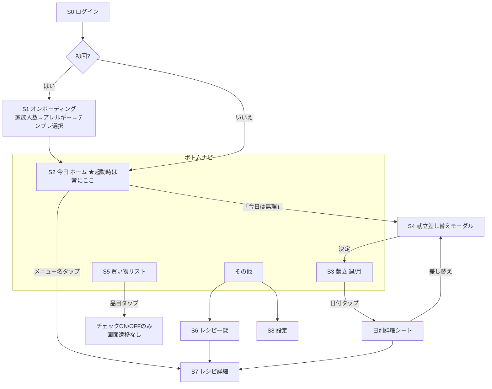

# 家庭向け献立管理アプリ 要件定義書 v1.1

**仮称:「きょうのごはん」**
**作成日: 2026-07-30 / v1.1: 2026-07-31(§16 季節差し替え・§17 子ども評価と作り直し を追加)**

---

## 0. コンセプト整理（設計の前提）

### 0-1. このアプリの本質

このアプリは**レシピアプリではなく、家庭運営の Todo アプリ**である。すべての設計判断は次の一文に従う。

> **アプリを開いて 5 秒以内に「今やること」が分かり、考える行為が一切発生しないこと。**

### 0-2. 「考えなくていい」を実現する仕組み（コアエンジン）

献立を毎日生成するのではなく、**「4週間ローテーション献立テンプレート」を1度作り、それをカレンダーに自動展開する**方式を採用する。

```
献立テンプレート（4週間分・28日 × 朝/夜）
        │ 自動展開（適用ボタン1つ / 将来は自動）
        ▼
実際のカレンダー（plan_entries）
        │ レシピの手順（朝の仕込み / 夜の調理）から自動生成
        ▼
今日のやることチェックリスト（ホーム画面）
        │ 週の献立から材料を自動集計
        ▼
週の買い物リスト
```

この一方向のデータフローが本アプリの心臓部。ユーザーが日常的に行う操作は
**「チェックを付ける」「買い物リストを見る」「たまに献立を差し替える」の3つだけ**にする。

### 0-3. 設計上の最重要判断（先に結論）

| 判断 | 内容 | 理由 |
|---|---|---|
| ① 食材管理（在庫）はMVPから外す | Phase 4 に後送り | 在庫入力は継続率を最も下げる機能。入力が続かず在庫データが嘘になると、それに依存する機能全部が壊れる |
| ② 献立は「生成」でなく「ローテーション」 | AI生成は将来機能 | 固定ローテ+差し替えの方が「考えない」を確実に実現でき、実装も1/10 |
| ③ ホーム画面 = 今日のチェックリストのみ | ナビゲーションなしで完結 | 5秒ルールの実現。開いた瞬間が今日 |
| ④ 買い物リストは献立から自動生成 | 手入力は補助のみ | 手作業のリスト作成が残ると「効率化」にならない |
| ⑤ 昼ごはんはスキーマだけ用意し画面には出さない | meal_type に lunch を定義済みにする | 将来追加時にDB移行不要 |

---

## 1. 画面一覧

MVPは **8画面 + ボトムナビ4タブ** に絞る。

| ID | 画面名 | パス | 概要 | タブ |
|---|---|---|---|---|
| S0 | ログイン | `/login` | Supabase Auth（メール + Google） | - |
| S1 | オンボーディング | `/welcome` | 初回のみ。家族人数 → アレルギー・苦手食材 → 献立テンプレート選択（3ステップ） | - |
| S2 | **今日（ホーム）** | `/` | 今日の朝・夜の献立と、やることチェックリスト。**アプリの顔** | 今日 |
| S3 | 献立 | `/plans` | 週表示（デフォルト）/ 月カレンダー表示の切替。4週間分を閲覧 | 献立 |
| S4 | 献立差し替え | `/plans` 内モーダル | 特定日のメニューを別レシピに入れ替え。「今日は無理」ボタンの遷移先 | - |
| S5 | 買い物リスト | `/shopping` | 週ごと・カテゴリ別・チェックボックス付き | 買い物 |
| S6 | レシピ一覧 | `/recipes` | 検索・カテゴリ絞り込み | その他 |
| S7 | レシピ詳細 | `/recipes/[id]` | 材料（人数連動）、朝の仕込み、夜の手順、保存方法、冷凍可否、弁当可否 | - |
| S8 | 設定 | `/settings` | 家族人数、アレルギー、苦手食材、食費目標、テンプレート管理 | その他 |

**ボトムナビは4タブ固定: 「今日」「献立」「買い物」「その他」。**
「その他」タブにレシピと設定をまとめる。日常動線（今日・献立・買い物）を最短にし、レシピは「調べ物」として一段奥に置く。

MVPに**含めない**画面: 食材管理、栄養分析、レシピ登録フォーム（MVP期間はレシピをシードデータで投入し、編集は最小限のフォームのみ）。

---

## 2. 画面遷移図



**遷移設計の原則**: 日常利用（チェックを付ける）は S2/S5 の**画面内で完結し、遷移ゼロ**。遷移が必要なのは「調べる・変更する」という非日常操作のときだけ。深さは最大2階層。

---

## 3. DB設計（Supabase / PostgreSQL）

### 3-1. ER概要

```
households ─┬─ profiles（auth.usersと1:1）
            ├─ family_members
            ├─ recipes ─┬─ recipe_ingredients
            │           └─ recipe_steps（phase: morning/evening）
            ├─ menu_templates ── template_entries
            ├─ plan_entries ── task_states（チェック状態）
            ├─ shopping_lists ── shopping_items
            └─ pantry_items（Phase 4）
```

### 3-2. テーブル定義

```sql
-- 世帯（データ共有の単位。家族全員が同じ household に属する）
create table households (
  id uuid primary key default gen_random_uuid(),
  name text not null default 'わが家',
  created_at timestamptz not null default now()
);

-- ユーザープロフィール（auth.users と 1:1）
create table profiles (
  id uuid primary key references auth.users(id) on delete cascade,
  household_id uuid not null references households(id),
  display_name text not null,
  created_at timestamptz not null default now()
);

-- 家族メンバー（アカウントを持たない子どもも登録できる）
create table family_members (
  id uuid primary key default gen_random_uuid(),
  household_id uuid not null references households(id),
  name text not null,
  is_adult boolean not null default true,
  allergies text[] not null default '{}',   -- 例: {'卵','えび'}
  dislikes text[] not null default '{}',    -- 苦手食材
  sort_order int not null default 0
);

-- レシピ
create table recipes (
  id uuid primary key default gen_random_uuid(),
  household_id uuid references households(id), -- null = 公式シードレシピ
  name text not null,
  category text not null default 'main',       -- main / soup / side / rice / breakfast
  servings_base int not null default 4,        -- 分量の基準人数
  prep_minutes int not null default 0,         -- 朝の仕込み時間
  cook_minutes int not null default 0,         -- 夜の調理時間
  freezable boolean not null default false,    -- 冷凍可否
  bento_ok boolean not null default false,     -- 翌日の弁当可否
  storage_note text,                           -- 保存方法
  tags text[] not null default '{}',
  meta jsonb not null default '{}',            -- 将来拡張用（栄養値・画像URL等）
  created_at timestamptz not null default now()
);

-- 材料（人数スケーリングは quantity × 人数 ÷ servings_base）
create table recipe_ingredients (
  id uuid primary key default gen_random_uuid(),
  recipe_id uuid not null references recipes(id) on delete cascade,
  name text not null,
  quantity numeric,                 -- null = 適量
  unit text,                        -- g / 個 / 大さじ …
  category text not null default 'other',
    -- meat / fish / vegetable / seasoning / frozen / dairy / other
  position int not null default 0
);

-- 手順（★ phase が本アプリの肝: 朝の仕込みと夜の調理を分けて持つ）
create table recipe_steps (
  id uuid primary key default gen_random_uuid(),
  recipe_id uuid not null references recipes(id) on delete cascade,
  phase text not null check (phase in ('morning','evening')),
  position int not null,
  text text not null,               -- 「鶏肉をタレに漬ける」
  minutes int                       -- 目安時間（任意）
);

-- 4週間献立テンプレート
create table menu_templates (
  id uuid primary key default gen_random_uuid(),
  household_id uuid references households(id),  -- null = 公式テンプレ
  name text not null,                           -- 「基本の4週間」
  weeks int not null default 4
);

create table template_entries (
  id uuid primary key default gen_random_uuid(),
  template_id uuid not null references menu_templates(id) on delete cascade,
  day_index int not null,           -- 0〜27（週×7+曜日）
  meal_type text not null check (meal_type in ('breakfast','lunch','dinner')),
  recipe_id uuid not null references recipes(id),
  unique (template_id, day_index, meal_type, recipe_id)
);

-- 実際のカレンダーに展開された献立
create table plan_entries (
  id uuid primary key default gen_random_uuid(),
  household_id uuid not null references households(id),
  date date not null,
  meal_type text not null check (meal_type in ('breakfast','lunch','dinner')),
  recipe_id uuid not null references recipes(id),
  servings int,                     -- null = 世帯デフォルト
  status text not null default 'planned',
    -- planned / done / skipped（外食等）
  unique (household_id, date, meal_type, recipe_id)
);

-- チェック状態（誰がいつチェックしたか）
create table task_states (
  id uuid primary key default gen_random_uuid(),
  plan_entry_id uuid not null references plan_entries(id) on delete cascade,
  step_id uuid not null references recipe_steps(id) on delete cascade,
  checked_by uuid references profiles(id),
  checked_at timestamptz not null default now(),
  unique (plan_entry_id, step_id)   -- 行が存在する = チェック済み
);

-- 買い物リスト（週単位）
create table shopping_lists (
  id uuid primary key default gen_random_uuid(),
  household_id uuid not null references households(id),
  week_start date not null,         -- 月曜日
  generated_at timestamptz,
  unique (household_id, week_start)
);

create table shopping_items (
  id uuid primary key default gen_random_uuid(),
  list_id uuid not null references shopping_lists(id) on delete cascade,
  name text not null,
  quantity numeric,
  unit text,
  category text not null default 'other',
  source text not null default 'auto',   -- auto（献立由来）/ manual（手追加）
  checked boolean not null default false,
  checked_by uuid references profiles(id),
  position int not null default 0
);

-- 世帯設定
create table household_settings (
  household_id uuid primary key references households(id),
  default_servings int not null default 5,
  monthly_budget int,               -- 食費目標（円）
  week_starts_on int not null default 1  -- 1=月曜
);

-- Phase 4: 食材在庫（MVPでは作らない。設計だけ確保）
-- pantry_items (id, household_id, name, quantity, unit, category,
--               expires_on, created_at)
```

### 3-3. Row Level Security（RLS）方針

全テーブルで RLS を有効化し、**「自分の household のデータのみ読み書き可」**の1ルールに統一する。

```sql
-- 例: plan_entries
create policy "household members only" on plan_entries
  for all using (
    household_id = (select household_id from profiles where id = auth.uid())
  );
-- household_id が null の行（公式レシピ・公式テンプレ）は select のみ全員許可
```

家族共有は「同じ household_id を持つ」だけで実現でき、アプリ側に共有ロジックが不要になる。招待は「招待コード（households.id を短縮したもの）を入力すると profiles.household_id が書き換わる」方式が最小実装。

---

## 4. コンポーネント設計

### 4-1. 設計方針

- **UI部品（ui/）とドメイン部品（features/）を分離**。ui/ は shadcn/ui ベースの汎用部品でドメイン知識を持たない
- ドメイン部品は「1画面 = 1 feature ディレクトリ」で対応付け、迷子にならない構成にする
- チェックリストは今日画面・買い物で共通の `Checklist` 抽象を使う

### 4-2. 主要コンポーネントツリー

```
<TodayPage>                        … S2 今日
├─ <DateHeader>                    … 「7月31日（金）」+ 進捗リング
├─ <MealSection meal="breakfast">
│   ├─ <MealHeading>               … 「朝ごはん」+ メニュー名 + 合計時間
│   └─ <TaskChecklist>             … チェックリスト本体
│       └─ <TaskItem>              … 大きなタップ領域 + 完了アニメ
├─ <MealSection meal="dinner">
│   ├─ <PrepDoneBadge>             … 「朝の仕込み済み」表示
│   └─ <TaskChecklist>
└─ <EscapeHatch>                   … 「今日は無理」ボタン → 差し替えモーダル

<PlansPage>                        … S3 献立
├─ <ViewToggle>                    … 週 / 月 切替
├─ <WeekStrip> | <MonthCalendar>
├─ <DaySheet>                      … 日付タップで下からシート
│   └─ <MealCard> × n
└─ <SwapModal>                     … S4 差し替え（候補レシピをカードで提示）

<ShoppingPage>                     … S5 買い物
├─ <WeekSelector>
├─ <GenerateButton>                … 「今週のリストを作る」
├─ <CategorySection> × n           … 肉/魚/野菜/調味料/冷凍/その他
│   └─ <ShoppingItem>              … チェック + 数量
└─ <QuickAddInput>                 … 手動追加（1行入力）

<RecipeDetailPage>                 … S7
├─ <RecipeHeader>                  … 名前・時間・冷凍/弁当バッジ
├─ <ServingsControl>               … 人数±で分量が即時再計算
├─ <IngredientList>
├─ <StepList phase="morning">      … 朝の仕込み
├─ <StepList phase="evening">      … 夜の手順
└─ <StorageNote>
```

### 4-3. 共通UI部品（ui/）

Button / Checkbox（44px以上のタップ領域） / BottomNav / Sheet（下から出るモーダル） / Card / Badge / ProgressRing / EmptyState。**MVPで作る汎用部品はこの8個まで**と上限を決め、部品作りに時間を溶かさない。

---

## 5. ディレクトリ構成（Next.js App Router）

```
src/
├─ app/
│  ├─ (auth)/
│  │  ├─ login/page.tsx
│  │  └─ welcome/page.tsx          # オンボーディング
│  ├─ (main)/                      # ボトムナビ付きレイアウト
│  │  ├─ layout.tsx                # <BottomNav> はここ
│  │  ├─ page.tsx                  # S2 今日（ホーム）
│  │  ├─ plans/page.tsx            # S3 献立
│  │  ├─ shopping/page.tsx         # S5 買い物
│  │  ├─ recipes/
│  │  │  ├─ page.tsx               # S6 一覧
│  │  │  └─ [id]/page.tsx          # S7 詳細
│  │  └─ settings/page.tsx         # S8 設定
│  └─ api/                         # Route Handlers（3-4本のみ。§6参照）
│     ├─ plans/apply-template/route.ts
│     └─ shopping/generate/route.ts
├─ components/
│  ├─ ui/                          # 汎用部品（ドメイン知識なし）
│  └─ features/
│     ├─ today/                    # TaskChecklist, MealSection …
│     ├─ plans/                    # WeekStrip, SwapModal …
│     ├─ shopping/
│     ├─ recipes/
│     └─ settings/
├─ lib/
│  ├─ supabase/
│  │  ├─ client.ts                 # ブラウザ用クライアント
│  │  ├─ server.ts                 # Server Component / Route Handler 用
│  │  └─ middleware.ts             # セッションリフレッシュ
│  ├─ services/                    # ★ ビジネスロジック層（§14, §15の要）
│  │  ├─ planService.ts            # テンプレ展開・差し替え
│  │  ├─ shoppingService.ts        # 材料集計 → リスト生成
│  │  ├─ taskService.ts            # チェックのトグル
│  │  └─ menuSuggester/            # ★ 将来AIが入る差し替え口
│  │     ├─ index.ts               # interface MenuSuggester
│  │     └─ rotation.ts            # MVP実装（ローテーション）
│  ├─ scaling.ts                   # 人数×分量の計算（純関数）
│  └─ dates.ts                     # 週の開始日など日付ユーティリティ
├─ hooks/                          # useTodayPlan, useToggleTask …
├─ stores/                         # Zustand（UI状態のみ、最小限）
├─ types/
│  ├─ database.ts                  # supabase gen types で自動生成
│  └─ domain.ts                    # アプリ内ドメイン型
└─ supabase/
   ├─ migrations/                  # SQLマイグレーション（git管理）
   └─ seed.sql                     # 公式レシピ・公式テンプレのシード
```

原則: **ページは薄く、ロジックは services/ に、計算は純関数に**。ページコンポーネントは「データを取ってコンポーネントに渡す」以上のことをしない。

---

## 6. API設計

### 6-1. 方針

Supabase を使うため、**単純な CRUD は PostgREST（supabase-js）+ RLS で直接行い、REST API は自作しない**。Route Handler / RPC を作るのは「複数テーブルにまたがる書き込み」か「集計ロジック」がある場合のみ。

### 6-2. 読み取り(supabase-js クエリ / DBビュー)

| 用途 | 実装 |
|---|---|
| 今日の画面 | ビュー `v_daily_plan`: plan_entries + recipes + recipe_steps + task_states を日付で JOIN。1クエリで今日画面の全データが揃う |
| 週の献立 | `plan_entries` を date range で select（recipes を埋め込み） |
| レシピ詳細 | `recipes` + ingredients + steps をネスト select |
| 買い物リスト | `shopping_lists` + items を week_start で select |

### 6-3. 書き込み(RPC / Route Handler)

| エンドポイント | 種別 | 内容 |
|---|---|---|
| `rpc: toggle_task(plan_entry_id, step_id)` | Postgres関数 | task_states に行を insert / delete（トグル）。冪等 |
| `POST /api/plans/apply-template` | Route Handler | テンプレを指定日から28日分 plan_entries に展開。既存分は上書き確認 |
| `PATCH plan_entries`（直接） | supabase-js | 差し替え（recipe_id の付け替え）・外食スキップ |
| `POST /api/shopping/generate` | Route Handler | 指定週の plan_entries → 材料を人数換算で集計 → 同名+同単位をマージ → shopping_items へ。手動追加分(source='manual')とチェック済みは保持して再生成可能 |
| `PATCH shopping_items`（直接） | supabase-js | チェックON/OFF、手動追加 |

**買い物リスト生成の集計ルール**(shoppingService の中核):
名寄せは MVP では「材料名の完全一致 + 単位一致」のみでマージし、一致しなければ別行として出す（過剰に賢くしない）。調味料カテゴリはデフォルトでリストに載せず、「調味料も表示」トグルで展開（毎週醤油を買わないため）。

### 6-4. リアルタイム

Supabase Realtime を `task_states` と `shopping_items` だけに絞って購読。夫がスーパーで買った品物が妻の画面でも即チェックされる、が最小のリアルタイム要件。

---

## 7. 状態管理設計

### 7-1. 3層に分けて考える

| 層 | 中身 | 道具 |
|---|---|---|
| サーバー状態 | 献立・レシピ・買い物リスト・チェック状態 | **TanStack Query**（+ supabase-js） |
| UI状態 | 表示中の週、週/月トグル、モーダル開閉 | **Zustand**（ストア1個・10行程度）または useState |
| 認証状態 | セッション | Supabase Auth + middleware（独自管理しない） |

**グローバル状態を増やさない**ことが最大の設計。「サーバーにあるものは TanStack Query のキャッシュが唯一の真実」とし、Redux 的な二重管理はしない。

### 7-2. チェック操作は楽観的更新（最重要UX）

チェックのタップは**即座にUIへ反映し、裏で RPC を投げる**。失敗時のみロールバック + トースト。台所で濡れた手で使うアプリに通信待ちのスピナーは許されない。

```
tap → キャッシュを即時更新（onMutate）→ rpc toggle_task
     → 失敗時のみ元に戻す（onError）→ 再取得で整合（onSettled）
```

### 7-3. Realtime との併用

Realtime の変更通知は「TanStack Query のキャッシュを invalidate する」だけに使い、状態を二重に持たない。将来の PWA オフライン対応もこの層（Query の persist + mutation queue）に足すだけで済む。

---

## 8. MVPに不要な機能（明示的にやらないことリスト)

「やらない」を決めることが MVP の本体。以下は**実装しない**。

| 機能 | 除外理由 | 復活時期 |
|---|---|---|
| **食材管理（在庫・賞味期限）** | 入力負担が最大で継続率を殺す。買い物リストが機能すれば在庫管理の必要性自体が下がる | Phase 4（買い物リストの購入実績から半自動で在庫を推定できるようになってから） |
| 昼ごはん | 平日昼は各自外食・給食の家庭が多い。DBには meal_type='lunch' を定義済みなので追加はいつでも可能 | Phase 3以降 |
| レシピ画像・動画 | 「見て楽しむアプリ」ではない。テキストで十分成立する | Phase 5 |
| AI献立提案 | ローテーションで目的は達成できる | Phase 5 |
| 栄養分析・カロリー | 精密にやると食材マスタが必要で重い。MVPでは「主菜+汁物+副菜の型」をテンプレ側で担保する設計論的アプローチで代替 | Phase 5 |
| LINE通知・プッシュ通知 | PWA化とセットでやるべき | Phase 3 |
| 音声入力・バーコード | ガジェット的機能。コア価値に寄与しない | 未定 |
| Googleカレンダー連携・特売連携 | 外部依存が重い | 未定 |
| PDF出力・印刷 | ブラウザ印刷で代替可能 | 未定 |
| 家族ごとの好み学習 | データが貯まってから | Phase 5 |
| レシピの本格的な登録・編集UI | MVP期間は公式シードレシピ約60品で回す。自作レシピは名前+材料+手順の最小フォームのみ | Phase 2で最小版 |

---

## 9. 将来的な拡張性

**「後から足せる」ためにMVP時点で仕込んでおくのは次の5点だけ**。それ以外の将来対応コードは書かない（YAGNI）。

1. **meal_type に lunch を最初から定義** — 昼追加時にマイグレーション不要
2. **recipes.meta / tags（jsonb・配列）** — 栄養値、画像URL、季節タグなどをスキーマ変更なしで追加できる
3. **MenuSuggester インターフェース**（§15） — ローテーション実装とAI実装を差し替え可能に
4. **household 単位のデータ設計** — 買い物共有・家族間リアルタイムは既にRLS/Realtimeの構造で対応済み。機能追加はUIだけ
5. **task_states に checked_by** — 「誰がやったか」が記録されるので、家族の分担可視化・ゲーミフィケーションが後付けできる

外食日の自動調整は `plan_entries.status='skipped'` が既に受け皿。Googleカレンダー連携は「外部イベント → skipped を自動生成する」だけの追加で済む構造になっている。

---

## 10. UX改善案

1. **起動 = 今日画面。** ログイン後もタブ復帰も常に「今日」。スプラッシュや「おすすめ」を挟まない
2. **時間帯で自動フォーカス。** 午前は朝セクション、15時以降は夜セクションを自動で開き、他方は折りたたむ。スクロールすら不要に
3. **「今日は無理」ボタン（エスケープハッチ）。** 疲れた日に罪悪感なく、①15分以内の楽メニューに差し替え ②外食にする（skipped）③明日と入れ替え、の3択を1タップで提示。**このボタンがあるからアプリを捨てずに済む**
4. **「朝済み」バッジ。** 夜のタスクリスト冒頭に「朝の仕込み済み✓」を表示し、夜の自分に安心を渡す
5. **買い物リストは店の順路順。** カテゴリ並びを「野菜→肉→魚→冷凍→調味料」などスーパーの動線に合わせて並び替え可能に（設定で1回だけ調整）
6. **調味料は隠す。** 買い物リストで調味料はデフォルト非表示（§6-3）。リストが短いことが正義
7. **人数はレシピ詳細で±するだけで全材料が即再計算。** 「大人2+子3」は設定で係数化（子どもは0.6人前など）し、普段は意識させない
8. **チェックの取り消しは同じ場所をもう1回タップ。** 削除・編集メニューを出さない。迷わせない
9. **空状態を作らない。** オンボーディングでテンプレ選択が完了するため、初回起動時から「今日の献立」が必ず表示される。空のカレンダーを見せた瞬間にこのアプリは死ぬ
10. **文言は動詞で書く。**「本日の献立」ではなく「今日やること」。ラベル1つまで Todo アプリの言葉を使う

---

## 11. 毎日使いたくなるUIアイデア

1. **進捗リング。** 今日のタスク完了率を日付横に小さく表示。全完了で1回だけ小さな祝アニメ（派手にしない。毎日のことなので）
2. **連続日数（ストリーク）は「見るだけ」で表示。** チェックしなくても開いただけでカウント。プレッシャー装置ではなく習慣の可視化として
3. **夜完了時に明日をチラ見せ。**「今日もおつかれさま。明日の夜は唐揚げ」と1行だけ。明日開く理由を作る
4. **家族のチェックが見える。** 「✓ パパが買いました」のように checked_by を小さく表示。買い物の重複と「買っといてくれたんだ」の小さな喜び
5. **完了タスクはグレーアウトして下に沈む。** 残りだけが目に入る。Todoアプリの文法に忠実に
6. **週末に1枚のサマリ。**「今週は21食中19食を家で作りました」。食費目標(設定済み)との対比は Phase 2 で
7. **色は3色以内・アイコンは絵文字程度。** 「おしゃれな料理アプリ」の写真グリッドは作らない。情報密度より視認速度

---

## 12. 開発ロードマップ

| Phase | 期間目安 | 内容 | 完了の定義 |
|---|---|---|---|
| **0. 基盤** | 1週 | リポジトリ・Supabase・CI(Vercel)・スキーマ・RLS・シード（公式レシピ60品+公式テンプレ1本）・型生成 | seed投入済みDBにRLS越しでアクセスできる |
| **1. コア動線** | 3週 | 認証・オンボーディング・**今日画面**・献立(週表示)・レシピ詳細・テンプレ展開・チェック(楽観的更新) | 家族で1週間、実生活で毎日回せる |
| **2. 買い物** | 2週 | 買い物リスト自動生成・カテゴリ表示・手動追加・Realtime共有・最小レシピ登録 | 買い物リストを紙に書かなくなる |
| **3. 磨き込み** | 2週 | 月カレンダー・差し替えモーダル・「今日は無理」・設定画面完成・PWA化(ホーム追加+通知) | 家族3人以上が自分のスマホで使う |
| **4. 食材管理** | 2週 | pantry_items・買い物実績からの在庫登録・賞味期限アラート・リスト生成時の在庫差し引き | - |
| **5. AI・分析** | 継続 | MenuSuggester のAI実装(§15)・栄養表示・好み学習・LINE通知 | - |

**Phase 1 完了時点から自分の家庭で毎日使う（ドッグフーディング）**こと。このアプリの仕様は使ってみないと確定しない部分（タスクの粒度、テンプレの質）が多く、Phase 2 以降の優先度は実使用のストレスで並び替えるのが正しい。

---

## 13. 実装優先順位

| 優先度 | 機能 | 理由 |
|---|---|---|
| **P0**（これがないとアプリでない） | スキーマ+RLS / シードデータ / 認証 / 今日画面 / チェック機能 / テンプレ展開 | コンセプト「開くだけで今日が分かる」の最小構成 |
| **P1**（1ヶ月以内） | 週表示 / レシピ詳細(人数換算) / 買い物リスト生成 / 差し替え | 「買い物効率化」までがユーザー価値の本体 |
| **P2**（2〜3ヶ月） | 月カレンダー / 「今日は無理」 / Realtime共有 / PWA / 設定完成 / 最小レシピ登録 | 継続率と家族展開 |
| **P3**（その後） | 食材管理 / AI / 栄養 / 通知 | データと習慣が育ってから |

判断基準は常に「**毎日の5秒に効くか**」。効かない機能は自動的に P2 以下。

---

## 14. 保守しやすい設計

1. **ロジックの置き場所を1つに決める。** ビジネスルール（テンプレ展開、材料集計、人数換算）はすべて `lib/services/` の純粋なTypeScript関数に置き、コンポーネント・Route Handler・将来のEdge Functionのどこからでも呼べる形にする。**画面にロジックを書かない**
2. **型はDBから自動生成。** `supabase gen types typescript` を CI に組み込み、スキーマと型のズレを機械的に検出。手書きの型二重管理をしない
3. **マイグレーションはSQLファイルでgit管理。** Supabase Studio での手変更を禁止し、`supabase/migrations/` が唯一の真実
4. **入力バリデーションは zod でスキーマ化**し、フォーム・API・シードで同じスキーマを共有
5. **テストは計算ロジックに集中。** UIテストは最小限にし、`scaling.ts`（人数換算）と `shoppingService`（材料集計・名寄せ）に単体テストを厚く書く。ここがバグると家庭で実害が出る
6. **命名はドメイン用語集を README に置く。** plan / template / task / step の使い分けを最初に文書化（この文書の§3が原型）
7. **依存は増やさない。** MVPの外部依存は Next.js / supabase-js / TanStack Query / Zustand / Tailwind / shadcn / zod / date-fns 程度で打ち止め

---

## 15. AI機能を追加しやすいアーキテクチャ

### 15-1. 差し替え口を1つだけ用意する

```typescript
// lib/services/menuSuggester/index.ts
export interface MenuSuggester {
  suggestWeek(input: {
    householdId: string;
    weekStart: string;
    constraints: {
      allergies: string[];
      dislikes: string[];
      maxCookMinutes?: number;
      pantry?: PantryItem[];      // Phase 4以降に埋まる
      recentRecipeIds: string[];  // 直近の重複回避
    };
  }): Promise<SuggestedPlan[]>;
}

// MVP実装: テンプレートローテーション（AIなし・決定的）
export class RotationSuggester implements MenuSuggester { ... }

// 将来実装: 同じ型で返すLLM版。呼び出し側は一切変更不要
export class AiSuggester implements MenuSuggester { ... }
```

### 15-2. AIが後から効く理由は「データが構造化されているから」

- レシピが **材料(量・単位・カテゴリ) / 朝夜の手順 / 所要時間 / 制約(冷凍・弁当)** に正規化されているため、そのままLLMのコンテキストやFunction Callingのスキーマになる
- `task_states.checked_by/checked_at`、`plan_entries.status`(skipped含む)、買い物のチェック実績が**行動ログ**として自然に蓄積される。「好み学習」「外食パターン学習」はこのログを読むだけで始められる
- アレルギー・苦手食材が構造化済みなので、AI提案時のハードフィルタ（安全制約）をSQL側で先に適用できる。**アレルギー除外をLLM任せにしない**

### 15-3. 実行場所

AI呼び出しは Supabase Edge Functions（または Next.js Route Handler）に置き、`MenuSuggester` の実装としてサービス層から呼ぶ。ストリーミング表示が欲しくなったら Route Handler 側に寄せる。**フロントから直接LLM APIを叩かない**（キー管理・コスト制御・プロンプトの版管理をサーバー側に集約）。

### 15-4. AI第1弾のおすすめ

いきなり「4週間分の献立生成」ではなく、**「差し替え候補の提案」から始める**のが低リスク。「今日は無理」モーダルの選択肢3件をAIが選ぶ——既存UIのまま、失敗してもローテーションにフォールバックできる。AIは主役ではなく、ローテーションの隙間を埋める脇役から入れる。

---

## 16. 季節対応(春夏秋冬の差し替え) — v1.1追加

### 16-1. 方針: 「4テンプレート」ではなく「共通ベース + 季節差し替え」

季節ごとに28日分を別テンプレートにすると、レシピと買い物リストの管理量が4倍になり、家族が覚えた定番も季節ごとにリセットされる。そこで**ベーステンプレートは1本のまま、季節ごとに6〜8品だけ入れ替える**方式を採用する。

- 定番の約7割(照り焼き・唐揚げ・丼もの・餃子など)は通年固定 → 「考えない」「覚える量最小」を維持
- 差し替え枠は主に「土曜の煮込み系」「木曜の麺」「火曜の魚種」→ 季節感が最も出る場所だけ動かす
- 例(夏): カレー→夏野菜カレー / シチュー→豚しゃぶサラダ / 焼きうどん→冷やしぶっかけうどん / ちゃんちゃん焼き→あじの開き / ハヤシ→タコライス / ナポリタン→肉味噌そうめん

### 16-2. DB設計の追加

```sql
-- レシピに適した季節(空 = 通年)
alter table recipes add column seasons text[] not null default '{}';
  -- 例: {'summer'} / {'autumn','winter'}

-- 季節差し替え定義(ベーステンプレートに対する差分)
create table seasonal_swaps (
  id uuid primary key default gen_random_uuid(),
  template_id uuid not null references menu_templates(id) on delete cascade,
  season text not null check (season in ('spring','summer','autumn','winter')),
  from_recipe_id uuid not null references recipes(id),
  to_recipe_id uuid not null references recipes(id),
  unique (template_id, season, from_recipe_id)
);
```

### 16-3. 適用ロジックとUI

`POST /api/plans/apply-template` が展開時に **日付から季節を判定し(3-5月=春/6-8月=夏/9-11月=秋/12-2月=冬)、該当する seasonal_swaps を自動適用**する。ユーザー操作は不要 — 6月に入って展開すれば勝手に夏メニューになる。これが「考えなくていい」の季節版。

UIへの露出は最小限: 献立画面に「☀️夏メニュー適用中」のバッジを1つ出すだけ。設定に「季節の自動切替 ON/OFF」を置く(OFF固定運用も許す)。季節の変わり目に翌週分から新季節が適用され、**展開済みの週は書き換えない**(急にメニューが変わる驚きを与えない)。

実装時期: 差し替えの仕組み自体は Phase 2〜3 で薄く入る(swapsテーブルを読むだけ)。季節レシピの拡充はコンテンツ作業として継続。

---

## 17. 子どもの評価と献立の作り直し — v1.1追加

### 17-1. コンセプト: 「採点」ではなく「食卓の記録」

子ども3人それぞれの「好き❤️ / ふつう / 苦手」を食後に記録し、それを次の献立に反映する。目的は2つ: **苦手の連発を防ぐ**(食べない夕食は作った時間ごと無駄になる)と、**好きの頻度を上げる**(「またこれがいい」を仕組みで叶える)。これは §15 で設計した好み学習・AI提案の**教師データそのもの**であり、早く貯め始めるほど価値が出るため、記録機能だけ Phase 3 に前倒しする。

### 17-2. DB設計の追加

```sql
-- 食事単位のフィードバック(レシピ単位でなく「その日の食事」に紐づける)
create table meal_feedback (
  id uuid primary key default gen_random_uuid(),
  plan_entry_id uuid not null references plan_entries(id) on delete cascade,
  family_member_id uuid not null references family_members(id) on delete cascade,
  rating text not null check (rating in ('love','ok','no')),
  note text,                        -- 「タレが辛かった」等の一言(任意)
  created_at timestamptz not null default now(),
  unique (plan_entry_id, family_member_id)  -- 同じ食事への再評価は上書き
);

-- レシピ×人の集計ビュー(直近を重視: 子どもの好みは変わる)
create view v_recipe_scores as
select r.id as recipe_id, f.family_member_id,
       count(*) filter (where mf.rating='love') as loves,
       count(*) filter (where mf.rating='no')   as nos,
       max(mf.created_at) as last_rated_at
from meal_feedback mf
join plan_entries pe on pe.id = mf.plan_entry_id
join recipes r on r.id = pe.recipe_id
join family_members f on f.id = mf.family_member_id
group by 1, 2;
```

食事(plan_entry)単位で記録するのが重要。同じ唐揚げでも「今日は残した」が起こり、その履歴こそが学習データになる。レシピに直接スコアを持たせると履歴が消える。

### 17-3. 入力UI: 10秒で終わる評価モーダル

夜の手順を全部チェックした瞬間(=食事が終わる頃)に1回だけ出す:

```
今日の「タコライス」どうだった?
  たろう   ❤️ 😐 ✖️
  はなこ   ❤️ 😐 ✖️
  じろう   ❤️ 😐 ✖️
          〔あとで〕〔スキップ〕
```

3人×1タップ=最大3タップ、10秒以内。**スキップを常に許し、未評価をバッジ等で催促しない**(義務になった瞬間に使われなくなる)。「あとで」は翌朝の今日画面に1行だけ再表示。

### 17-4. 「作り直し」は2段階で実装する

**Step 1(Phase 3・評価と同時): 差し替え候補への反映。** 自動では何も変えない。「今日は無理」や献立差し替えモーダルの候補の並び順に評価を反映する — ❤️が多いレシピを上に、✖️が2人以上のレシピを下に(理由表示: 「はなこが苦手×2回」)。既存UIのまま、並び順だけが賢くなる。

**Step 2(Phase 5): テンプレートの作り直し提案。** 月1回、評価が貯まったタイミングで提案する:

```
先月の記録から:
  ✖️ さばの味噌煮(3人とも苦手×2回)→ かじきの照り焼きに入替?
  ❤️ タコライス(全員大好き)→ 月2回に増やす?
      〔まとめて反映〕〔1つずつ選ぶ〕〔今のままにする〕
```

反映先は plan_entries(展開済みの直近分)ではなく **menu_templates(テンプレート自体)**。一度反映すれば以後ずっと効く。これは §15 の `MenuSuggester.suggestWeek()` の constraints に `scores`(v_recipe_scores)を渡すだけで実装でき、ローテーション実装でもAI実装でも同じ入口で機能する。**勝手に献立を書き換えることは絶対にしない** — 提案→承認の1タップを必ず挟む(家庭運営ツールにおける信頼の根幹)。

### 17-5. 交換ルール(Step 2 のロジック)

- 除外条件: 直近2回連続で2人以上が ✖️ → 交換候補入り
- 交換先の選定: 同カテゴリ(魚は魚と交換)+ 同じ曜日枠の制約(土曜は30分枠) + 季節一致 + ❤️実績 or 未評価の新顔
- 魚曜日(火・金)は維持する — 「子どもが魚に✖️ばかり付けるので魚が消える」を防ぎ、栄養バランスの下限をルールで守る。魚種の交換のみ許す
- 頻度上限: 同一レシピは週1まで(❤️連発でも唐揚げ週3にはしない)

### 17-6. 画面・優先順位への反映

画面一覧に **S9 評価モーダル**(今日画面内)を追加。実装優先順位は「評価の記録 = P2(Phase 3)」「並び順反映 = P2」「テンプレ作り直し提案 = P3(Phase 5)」。ロードマップ §12 の Phase 3 に「評価記録」、Phase 5 に「作り直し提案」を追記する。

---

## 付録A. 今日画面のワイヤー(テキスト)

```
┌─────────────────────────┐
│ 7月31日（金）      ◔ 3/9 │ ← 進捗リング
│─────────────────────────│
│ 朝ごはん  ごはん・味噌汁・納豆   │
│ 所要 10分                │
│  ✓ ご飯を温める          │ ← 完了はグレーで下に沈む
│  ✓ 味噌汁を温める        │
│  □ 納豆を出す            │
│  □ バナナを切る          │
│─────────────────────────│
│ 夜ごはん  鶏の照り焼き 🕐25分   │
│ ✓ 朝の仕込み済み（タレ漬け）│
│  □ フライパンを温める     │
│  □ 鶏肉を焼く            │
│  □ タレを絡める          │
│  □ 味噌汁を作る          │
│                          │
│      〔 今日は無理 〕      │ ← エスケープハッチ
│─────────────────────────│
│  今日 | 献立 | 買い物 | その他 │ ← ボトムナビ
└─────────────────────────┘
```

## 付録B. 最初の意思決定チェックリスト

開発着手前に決めること: アプリ名 / 公式テンプレ1本目の28日分メニュー(最重要コンテンツ。開発と並行して家庭で先に紙で回すとよい) / 子どもの人前係数(0.5〜0.7) / 週の開始曜日(買い物する曜日に合わせる)。
